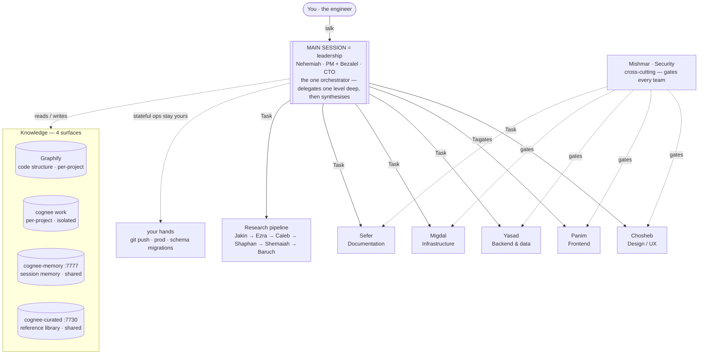

<div align="center">

# מִשְׁכָּן · MISHKAN

**A personal SWE R&D harness that lives inside Claude Code.**

45 specialist agents · six teams · one research pipeline · one growing knowledge graph

</div>

---

MISHKAN turns Claude Code into a standing engineering organisation. Quality and security aren't requested from the model — they're enforced by the environment: path-scoped rules, pre-write security hooks, structural separation of generation from review. The knowledge graph (Cognee) persists what you learn so sessions pick up where the last one stopped. A code-structure graph (Graphify) answers "who calls X, who depends on Y" at 88× less token cost than loading source files.

It's personal, opinionated infrastructure built around one engineer's standards. To make it yours, replace `docs/engineer/profile.md` and re-sync — nothing else hardcodes the author.

> **v0.2.7** — agent fleet, rules, hooks, installer stable. Unified semantic `mishkan <object> <verb>` CLI (D-015) with engineer-gated curated promotion (`knowledge curate`, D-016), user-editable model-tier routing (`model`, D-017), and a confirm-gated `knowledge reset`. Cognee knowledge stack (per-project work · memory `:7777` · curated `:7730`) + Graphify code graph. Observability stack (watchd + TUI) as two `uv tool`-installable packages.

---

## Install

Requires Claude Code + Node ≥ 18.

```bash
npx mishkan-harness install
mishkan status
mishkan observability install      # optional: daemon + TUI (needs uv)
```

Full guide: [`docs/usage/01-installation.md`](docs/usage/01-installation.md).

## First session

```bash
cd <project>
claude                    # starts in exploration mode — Nehemiah + Bezalel
/mishkan-init             # scaffold: spec chain → docs/ → Cognee → Sprint S0
```

`/sprint-close` at a milestone. `/mishkan-resume` restores state next session. Details: [`docs/usage/02-project-init.md`](docs/usage/02-project-init.md).

---

## The teams

**Nehemiah** (PM — scope, delivery, sprint) and **Bezalel** (CTO — architecture, standards, quality bar) route everything. Six teams, each `Lead → Specialists → QA → Reporter`:



*One leadership session (Nehemiah + Bezalel) delegates one level deep to the six teams + the
research pipeline, then synthesises. Within each team: `Lead → Specialists → QA → Reporter`
(QA & Reporter structurally separate — no agent grades its own work). Mishmar's security gate
crosses every team. It reads/writes four knowledge surfaces, and **stateful operations — `git
push`, production, schema migrations — stay in your hands** (the asymmetric AI/human boundary).
Diagrams render on GitHub.*

| Team | Hebrew | Domain |
|------|--------|--------|
| **Chosheb** | *cunning work* | Design & UX |
| **Panim** | *face* | Frontend |
| **Yasad** | *foundation* | Backend & data |
| **Mishmar** | *guard* | Security (cross-cutting) |
| **Migdal** | *tower* | Infrastructure & ops |
| **Sefer** | *scroll* | Documentation (pull-based) |

A shared research pipeline (Jakin → Ezra → Caleb → Shaphan → Shemaiah → Baruch) is invokable by any agent that hits an unknown. All 45 names + biblical sources: [`docs/design/MISHKAN_agent_aliases.md`](docs/design/MISHKAN_agent_aliases.md).

---

## Knowledge stack

Wired by `/mishkan-init` into each project's `.mcp.json`:

**Cognee** — semantic knowledge graph. Per-project isolated work store (own port, Ladybug) + shared session memory (`cognee-memory`, `:7777`) + cross-project curated reference library (`cognee-curated`, `:7730`). Docker-based, pinned, SOPS-managed secrets. Three pillars wired per project by `/mishkan-init` (D-007 + D-012).

```bash
mishkan knowledge configure        # wizard: LLM provider + credentials + .env
mishkan knowledge-stack up         # memory :7777 + curated :7730 (guided; preflights config, seeds curated)
```

Guide: [`payload/mishkan/cognee/README.md`](payload/mishkan/cognee/README.md) · [`docs/usage/04-memory-layer.md`](docs/usage/04-memory-layer.md).

**Graphify** — deterministic code-structure graph (D-008 + D-009). Indexes a project's full AST into a queryable graph. For structural questions ("who calls X", "what depends on Y") it costs ~1.8k tokens per query — 88× cheaper than loading the source tree. Runs as a PreToolUse advisory: before every structural Read or Grep, agents see a palette of four surfaces (Graphify, Cognee work, Cognee curated, literal content) with token costs and staleness signals so they pick the cheap path first. Auto-detected and wired by `/mishkan-init`.

```bash
mishkan code-graph scan            # build/refresh for the current project
mishkan code-graph status          # node/edge count, last scan time
```

## Observability

Two Python packages (`uv tool`-installable): a daemon (`mishkan-watchd`) that tails every session's event bus and a Textual TUI (`mishkan-watch`) with 8 tabs — Live, Agents, Workflows, Knowledge, Activity, Org-Ref, Usage, Skills. Cross-session, cross-project, near-zero overhead.

```bash
mishkan observability install      # install both packages
mishkan-watch                      # opens TUI, auto-starts daemon if absent
mishkan-watchd start|stop|status   # manual daemon control
```

Guide + event schema: [`docs/design/MISHKAN_observability.md`](docs/design/MISHKAN_observability.md).

## Workflows

Beyond the agents, MISHKAN ships dynamic JavaScript workflows that orchestrate multiple subagents in parallel — fan-out/synthesize, pipeline, judge panel, adversarial verify, loop-until-X.

**Org-level (10):** `mishkan-sprint-close`, `mishkan-deep-research`, `mishkan-codebase-audit`, `mishkan-migration-wave`, `mishkan-architecture-panel`, `mishkan-release-readiness`, `mishkan-init`, `mishkan-blast-radius`, `mishkan-knowledge-gap-discovery`, `mishkan-standards-rollout`.

**Team-level (8):** `chosheb-feature-ship`, `panim-ds-rollout`, `yasad-data-migration-wave`, `yasad-schema-evolution`, `mishmar-security-gate`, `migdal-infra-change`, `migdal-dr-drill`, `sefer-release-notes`.

Governed by hard caps (10 org + 4 per team) and PM+CTO co-ownership per ADR D-010. Catalogue + cost expectations: [`payload/mishkan/workflows/README.md`](payload/mishkan/workflows/README.md).

---

## Slash commands (inside a Claude Code session)

| Command | Purpose |
|---|---|
| `/mishkan-init` | Scaffold a project — spec chain, docs, Cognee, Sprint S0 |
| `/mishkan-resume` | Restore sprint state + open blockers |
| `/sprint-close` | Team reporters → aggregate → docs pull → graph promote |
| `/mishkan-org-reference` | Print the 45-agent org inline |
| `/code-graph status\|open\|scan` | Inspect / open / refresh Graphify graph |
| `/skills <task>` | Skill-discovery router (3-bucket result) |
| `/mishkan-skills-reindex` | Rebuild skill index from disk |
| `/mishkan-skills-misses` | Aggregate miss-log for threshold tuning |
| `/eval-baruch` | Run Baruch contract eval |
| `/dep-audit` | Cross-project dependency + supply-chain audit |
| `/promote` | Promote a learning into Cognee by blast radius |
| `/sefer-pull` | Trigger documentation pull |

## CLI commands (from any terminal)

```bash
mishkan help                                        # full reference
mishkan install                                     # install/refresh into ~/.claude
mishkan uninstall                                   # remove harness (keeps CLAUDE.md + rules)
mishkan uninstall --purge                           # also remove y4nn-standards.md
mishkan knowledge configure                         # wizard: LLM provider + Cognee .env
mishkan knowledge curate                            # approve research-found resources into curated (D-016)
mishkan knowledge reset                             # wipe stores → re-seed curated baseline (destructive)
mishkan model show|set|reset                        # re-tier agents per-agent/team/all — survives updates (D-017)
mishkan observability install                       # install daemon + TUI only (needs uv)
mishkan status                                      # install state, profile, version
mishkan org show [--json]                                # print the 45-agent org
mishkan code-graph [status|open|scan]               # inspect the project's Graphify graph
mishkan-watch                                       # open observability TUI (auto-starts daemon)
mishkan-watch --no-autostart                        # TUI only, no daemon fork
mishkan-watchd start|stop|status                    # manual daemon lifecycle
```

---

## Customisation

The harness serves the engineer described in [`docs/engineer/profile.md`](docs/engineer/profile.md). Swap in your own (keep the section structure), then:

```bash
~/.claude/mishkan/scripts/sync-profile.sh
```

Refreshes the runtime copy and audits references. Nothing else hardcodes the author. See [`docs/engineer/README.md`](docs/engineer/README.md).

---

## Repository layout

```
bin/mishkan.js              installer (dependency-free)
payload/
  mishkan/                    agents, skills, rules, hooks, commands, templates, config, scripts, ontology
  user/                       user-level CLAUDE.md + standards rule (placed if absent)
  install/                    hook fragment merged into settings.json
docs/
  engineer/                   canonical engineer profile (replaceable)
  design/                     architecture, decisions, ontology, token model, observability
  usage/                      01-install … 12-skill-discovery
```

---

## Key design docs

| Doc | Covers |
|---|---|
| [Architecture](docs/design/MISHKAN_harness_design.md) | 5 layers, 6 teams, knowledge model |
| [Agent aliases](docs/design/MISHKAN_agent_aliases.md) | 45 agents + biblical sources |
| [Decisions](docs/design/MISHKAN_decisions.md) | Locked build decisions |
| [Cognee ontology](docs/design/MISHKAN_ontology.md) | Knowledge graph schema |
| [Token optimisation](docs/design/MISHKAN_token_optimisation.md) | Context cost model |
| [Observability](docs/design/MISHKAN_observability.md) | Daemon + TUI event schema |
| [Workflows](payload/mishkan/workflows/README.md) | Dynamic workflow catalogue |

Usage guides: [`docs/usage/`](docs/usage/).

---

## License

MIT — use it, fork it, make it serve your own engineering.

Built by **`>_theY4NN`** · [github.com/Y4NN777](https://github.com/Y4NN777)
