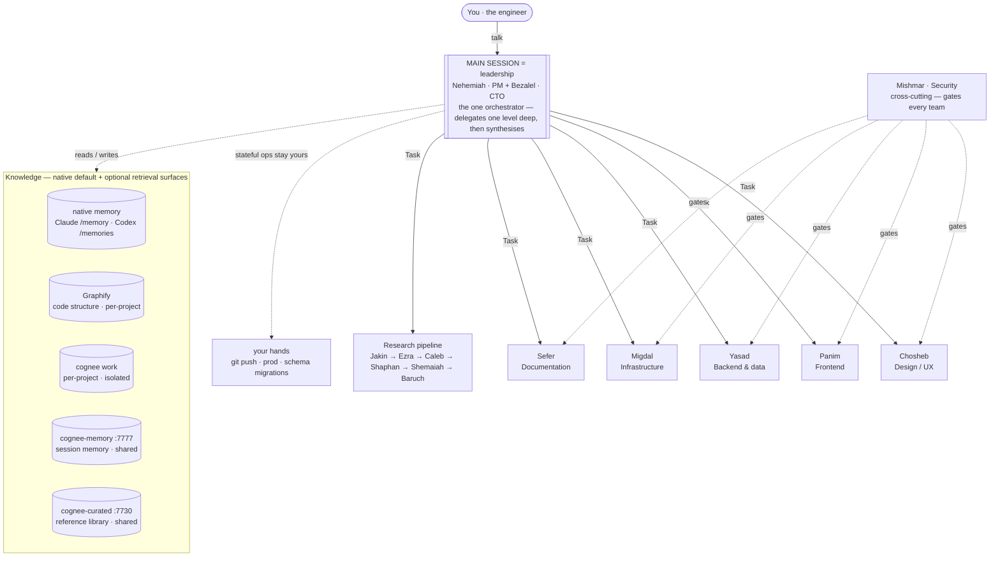

<div align="center">

# ARES Harness · MISHKAN Runtime

**A portable SWE R&D harness for Claude Code, Codex CLI, and OpenCode.**

45 specialist agents · six teams · one research pipeline · native memory by default, Cognee when needed

</div>

---

ARES packages the current MISHKAN agent organisation as a portable harness. Quality and security aren't requested from the model — they're enforced by the environment: target-native guidance, skills, commands, optional MCP wiring, hooks where audited, and structural separation of generation from review. Native runtime memory is the default recall layer; Cognee remains available when you need a queryable knowledge graph. A code-structure graph (Graphify) answers "who calls X, who depends on Y" at 88× less token cost than loading source files.

It's personal, opinionated infrastructure built around one engineer's standards. To make it yours, replace `docs/engineer/profile.md` and re-sync — nothing else hardcodes the author.

> **v0.2.8** — agent fleet, rules, hooks, installer stable. Unified semantic `ares <object> <verb>` CLI with legacy `mishkan` aliases, native memory by default, optional Cognee wiring via `--memory cognee|hybrid`, engineer-gated curated promotion (`knowledge curate`, D-016), user-editable model-tier routing (`model`, D-017), and a confirm-gated `knowledge reset`. Cognee knowledge stack (per-project work · memory `:7777` · curated `:7730`) + Graphify code graph stay available for advanced retrieval. Observability stack (`ares-watchd` + `ares-watch`) as two `uv tool`-installable packages.

---

## Install

Requires Node >= 18 plus at least one target runtime: Claude Code, Codex CLI, or OpenCode.

```bash
npx ares-harness install --target codex
npx ares-harness status --target all
npx ares-harness observability install      # optional: daemon + TUI (needs uv)
```

Full guide: [`docs/usage/01-installation.md`](docs/usage/01-installation.md).

## First session

```bash
cd <project>
claude                    # starts in exploration mode — Nehemiah + Bezalel
/ares-init                # Claude Code: scaffold spec chain → docs/ → memory → Sprint S0
```

In Codex, invoke `$ares-init` after install/project init, or select `ares-init`
through `/skills`. Codex does not support user-defined `/<skill-name>` commands,
so bare `/ares-init` remains a Claude Code/OpenCode entrypoint. Details:
[`docs/usage/02-project-init.md`](docs/usage/02-project-init.md).

---

## The teams

**Nehemiah** (PM — scope, delivery, sprint) and **Bezalel** (CTO — architecture, standards, quality bar) route everything. Six teams, each `Lead → Specialists → QA → Reporter`:



*One leadership session (Nehemiah + Bezalel) delegates one level deep to the six teams + the
research pipeline, then synthesises. Within each team: `Lead → Specialists → QA → Reporter`
(QA & Reporter structurally separate — no agent grades its own work). Mishmar's security gate
crosses every team. It reads/writes four knowledge surfaces, and **stateful operations — `git
push`, production, schema migrations — stay in your hands** (the asymmetric AI/human boundary).
Diagrams render on GitHub.*

| Team | Hebrew | Domain |
|------|--------|--------|
| **Chosheb** | *cunning work* | Design & UX |
| **Panim** | *face* | Frontend |
| **Yasad** | *foundation* | Backend & data |
| **Mishmar** | *guard* | Security (cross-cutting) |
| **Migdal** | *tower* | Infrastructure & ops |
| **Sefer** | *scroll* | Documentation (pull-based) |

A shared research pipeline (Jakin → Ezra → Caleb → Shaphan → Shemaiah → Baruch) is invokable by any agent that hits an unknown. All 45 names + biblical sources: [`docs/design/MISHKAN_agent_aliases.md`](docs/design/MISHKAN_agent_aliases.md).

---

## Memory and Knowledge

Default mode uses the runtime's native memory and versioned project docs:

- Claude Code: use `/memory`.
- Codex: use `/memories`.
- Required rules stay in `CLAUDE.md`, `AGENTS.md`, and `docs/`.

Cognee is optional. Wire it when you need semantic search, a curated library, or a queryable graph:

**Cognee** — semantic knowledge graph. Per-project isolated work store (own port, Ladybug) + shared session memory (`cognee-memory`, `:7777`) + cross-project curated reference library (`cognee-curated`, `:7730`). Docker-based, pinned, SOPS-managed secrets. The three pillars are wired only when you opt in with `--memory cognee` or `--memory hybrid` (D-007 + D-012).

```bash
ares project init --target all --memory cognee
ares knowledge configure           # wizard: LLM provider + credentials + .env
ares knowledge-stack up            # memory :7777 + curated :7730 (guided; preflights config, seeds curated)
```

Guide: [`payload/mishkan/cognee/README.md`](payload/mishkan/cognee/README.md) · [`docs/usage/04-memory-layer.md`](docs/usage/04-memory-layer.md).

**Graphify** — deterministic code-structure graph (D-008 + D-009). Indexes a project's full AST into a queryable graph. For structural questions ("who calls X", "what depends on Y") it costs ~1.8k tokens per query — 88× cheaper than loading the source tree. Runs as a PreToolUse advisory: before every structural Read or Grep, agents see a palette of four surfaces (Graphify, Cognee work, Cognee curated, literal content) with token costs and staleness signals so they pick the cheap path first. Auto-detected and wired by `/ares-init`.

```bash
ares code-graph scan               # build/refresh for the current project
ares code-graph status             # node/edge count, last scan time
```

## Observability

Two Python packages (`uv tool`-installable): a daemon (`ares-watchd`) that tails every session's event bus and a Textual TUI (`ares-watch`) with 8 tabs — Live, Agents, Workflows, Knowledge, Activity, Org-Ref, Usage, Skills. Cross-session, cross-project, near-zero overhead.

```bash
ares observability install         # install both packages
ares-watch                         # opens TUI, auto-starts daemon if absent
ares-watchd start|stop|status      # manual daemon control
```

Guide + event schema: [`docs/design/MISHKAN_observability.md`](docs/design/MISHKAN_observability.md).

## Workflows

Beyond the agents, MISHKAN ships dynamic JavaScript workflows that orchestrate multiple subagents in parallel — fan-out/synthesize, pipeline, judge panel, adversarial verify, loop-until-X.

**Org-level (10):** `mishkan-sprint-close`, `mishkan-deep-research`, `mishkan-codebase-audit`, `mishkan-migration-wave`, `mishkan-architecture-panel`, `mishkan-release-readiness`, `mishkan-init`, `mishkan-blast-radius`, `mishkan-knowledge-gap-discovery`, `mishkan-standards-rollout`.

**Team-level (8):** `chosheb-feature-ship`, `panim-ds-rollout`, `yasad-data-migration-wave`, `yasad-schema-evolution`, `mishmar-security-gate`, `migdal-infra-change`, `migdal-dr-drill`, `sefer-release-notes`.

Governed by hard caps (10 org + 4 per team) and PM+CTO co-ownership per ADR D-010. Catalogue + cost expectations: [`payload/mishkan/workflows/README.md`](payload/mishkan/workflows/README.md).

---

## Slash commands (inside a Claude Code session)

| Command | Purpose |
|---|---|
| `/ares-init` | Scaffold a project — spec chain, docs, memory, Sprint S0 |
| `/ares-resume` | Restore sprint state + open blockers |
| `/sprint-close` | Team reporters → aggregate → docs pull → graph promote |
| `/ares-org-reference` | Print the 45-agent org inline |
| `/code-graph status\|open\|scan` | Inspect / open / refresh Graphify graph |
| `/skills <task>` | Skill-discovery router (3-bucket result) |
| `/ares-skills-reindex` | Rebuild skill index from disk |
| `/ares-skills-misses` | Aggregate miss-log for threshold tuning |
| `/eval-baruch` | Run Baruch contract eval |
| `/dependency-audit` | Cross-project dependency + supply-chain audit |
| `/promote` | Promote a learning into Cognee by blast radius |
| `/sefer-pull` | Trigger documentation pull |

## CLI commands (from any terminal)

```bash
ares help                                           # full reference
ares install --target codex                         # install/refresh a target
ares project init --target codex                    # scaffold target-native project wiring, native memory
ares project init --target all --memory cognee       # opt into Cognee MCP wiring
ares uninstall                                      # remove Claude target files
ares knowledge configure                            # wizard: LLM provider + Cognee .env
ares knowledge curate                               # approve research-found resources into curated (D-016)
ares knowledge reset                                # wipe stores → re-seed curated baseline (destructive)
ares model show|set|reset                           # re-tier agents per-agent/team/all — survives updates (D-017)
ares observability install                          # install daemon + TUI only (needs uv)
ares status --target all                            # install state, profile, version
ares runtime check --target all --dir .             # global + current-project readiness checklist
ares org show [--json]                              # print the 45-agent org
ares code-graph [status|open|scan]                  # inspect the project's Graphify graph
ares-watch                                          # open observability TUI (auto-starts daemon)
ares-watch --no-autostart                           # TUI only, no daemon fork
ares-watchd start|stop|status                       # manual daemon lifecycle
```

---

## Customisation

The harness serves the engineer described in [`docs/engineer/profile.md`](docs/engineer/profile.md). Swap in your own (keep the section structure), then:

```bash
~/.ares/scripts/sync-profile.sh
```

Refreshes the runtime copy and audits references. Nothing else hardcodes the author. See [`docs/engineer/README.md`](docs/engineer/README.md).

---

## Repository layout

```
bin/mishkan.js              installer (dependency-free)
bin/ares.js                 primary ARES entrypoint
payload/
  core/                       runtime-neutral manifest; resolves the compatibility source tree
  targets/                    Claude, Codex, and OpenCode adapter manifests
  mishkan/                    current compatibility source: agents, skills, hooks, workflows, Cognee
  user/                       user-level CLAUDE.md + standards rule (placed if absent)
  install/                    hook fragment merged into settings.json
docs/
  engineer/                   canonical engineer profile (replaceable)
  design/                     architecture, decisions, ontology, token model, observability
  usage/                      01-install … 12-skill-discovery
```

---

## Key design docs

| Doc | Covers |
|---|---|
| [Architecture](docs/design/MISHKAN_harness_design.md) | 5 layers, 6 teams, knowledge model |
| [Agent aliases](docs/design/MISHKAN_agent_aliases.md) | 45 agents + biblical sources |
| [Decisions](docs/design/MISHKAN_decisions.md) | Locked build decisions |
| [Cognee ontology](docs/design/MISHKAN_ontology.md) | Knowledge graph schema |
| [Token optimisation](docs/design/MISHKAN_token_optimisation.md) | Context cost model |
| [Observability](docs/design/MISHKAN_observability.md) | Daemon + TUI event schema |
| [Workflows](payload/mishkan/workflows/README.md) | Dynamic workflow catalogue |

Usage guides: [`docs/usage/`](docs/usage/).

---

## License

MIT — use it, fork it, make it serve your own engineering.

Built by **`>_theY4NN`** · [github.com/Y4NN777](https://github.com/Y4NN777)
