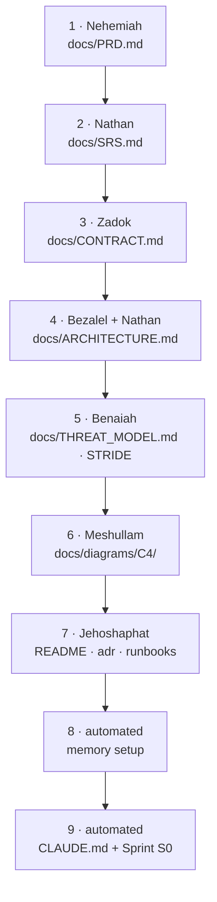

# 02 — Project Initialisation

> Goal: take a directory and add ARES target-native project wiring without
> overwriting existing project content.

## When and where to run it

```bash
cd <project root>
ares project init --target all   # writes target-native project wiring
ares project init --target all --memory cognee   # optional: also wire Cognee MCP
```

Inside a runtime session, use the native workflow entrypoint:

| Runtime | Init entrypoint |
|---|---|
| Claude Code | `/ares-init` |
| OpenCode | `/ares-init` |
| Codex | `$ares-init`, or select `ares-init` through `/skills` |

The init workflow is **not** something an agent should run unprompted — there
is an explicit precondition check.

## What Project Wiring Writes

`ares project init` writes the target-native surface for the runtimes you choose.

| Target | Files |
|---|---|
| Claude Code | `CLAUDE.md`, `.claude/settings.json`, `.claude/settings.local.json`, `.claude/rules/*`; `.mcp.json` only with `--memory cognee|hybrid` |
| Codex | `AGENTS.md`, `.codex/config.toml`, `.codex/hooks.json`, `.codex/agents/*` |
| OpenCode | `AGENTS.md`, `opencode.json`, `.opencode/agents/*`, `.opencode/commands/*`; Cognee MCP entries only with `--memory cognee|hybrid` |

Shared workflow skills remain global under `~/.agents/skills`; project init does
not duplicate them into `.agents/skills` or `.opencode/skills`. This avoids
non-deterministic duplicate discovery when Codex and OpenCode coexist. Shared
docs scaffolding is created only outside `--wiring-only`.

## Scope choice — greenfield vs brownfield

There are two common paths:

- **Wiring only** — run `ares project init --target all --wiring-only`. This
  writes only target-native state/config/hook/MCP files and does not generate
  docs, project agents, skills, or commands. Use it for a mature repo.
- **Full workflow** — first run `ares project init --target all`, then start
  the runtime and invoke `/ares-init` in Claude/OpenCode. In Codex, invoke `$ares-init` or select `ares-init` through `/skills`. Use it for greenfield or
  when you want the spec spine produced.

The full sequence (when chosen):

1. **Nehemiah** writes `docs/PRD.md`.
2. **Nathan** (Yasad) writes `docs/SRS.md`.
3. **Zadok** (Yasad) writes `docs/CONTRACT.md` — *invariants + guarantees*.
4. **Bezalel + Nathan** write `docs/ARCHITECTURE.md`.
5. **Benaiah** (Mishmar) writes `docs/THREAT_MODEL.md` (STRIDE).
6. **Meshullam** (Migdal) writes `docs/diagrams/C4/` (Context, Container, Component).
7. **Jehoshaphat** (Sefer) scaffolds `docs/README.md`, `docs/adr/`, `docs/runbooks/`.
8. **Automated** memory setup (native by default; optional Cognee, see below).
9. **Automated** project `CLAUDE.md` write + sprint S0.



Each step that touches a contract requires `/plan` to run first — nothing is generated
without its upstream artifact.

## Memory Setup At Init

The default memory backend is `native`. That means the project relies on the
runtime memory layer plus versioned repo docs:

- Claude Code: use `/memory`.
- Codex: use `/memories`.
- Required team/project rules stay in `CLAUDE.md`, `AGENTS.md`, and `docs/`.

No Cognee container, API key, or MCP config is required for the default path.

When you need a queryable graph, run project init with `--memory cognee` or
`--memory hybrid`. That writes the shared Cognee MCP aliases and leaves the
per-project work store explicit.

1. Bring up the shared stack when needed:

   ```bash
   ares knowledge-stack up
   ```

2. Provision this project's isolated work store explicitly:

   ```bash
   ares project-work-store up
   ```

3. Ingest only tagged or explicitly selected documents:

   ```bash
   ares knowledge ingest --tagged-only
   ```

The whole point is graph memory is opt-in: see [Selective ingest](./05-selective-ingest.md).

## What `CLAUDE.md` carries

A lean, dynamic file that loads **after** the user-level identity. It carries:

- Codebase orientation (stack, key directories) — concrete facts the
  main session needs every turn.
- Sprint slot — *current sprint*, *what's in flight*, *blockers*. Updated by
  `/ares-resume`, `/sprint-close`, and you.
- Memory backend (`native`, `cognee`, or `hybrid`). Cognee MCP aliases are
  present only when the project was initialized with `--memory cognee|hybrid`.
- A pointer to the existing `docs/` if there is one (does not duplicate).

## Brownfield handling — what does *not* happen

- **No overwrites.** Existing `AGENTS.md`, `CLAUDE.md`, `docs/*`, `.mcp.json`,
  Claude settings, Codex agent files, and OpenCode command files are preserved.
  ARES appends managed blocks where supported and uses no-clobber writes for
  project-owned files.
- **No translation.** If the existing docs are in another language (the
  aiobi-mail repo was largely French), the MISHKAN docs are written in English
  per rule 12 of `y4nn-standards.md`, alongside the existing corpus.
- **No reverse-engineered PRD.** If you pick "harness wiring only", no spec
  spine is fabricated.

## Confirming a clean init

After `ares project init --target all` completes:

```bash
# Claude wiring
ls -la CLAUDE.md .claude/settings.json .claude/settings.local.json

# Codex/OpenCode wiring
ls -la AGENTS.md .codex/config.toml .codex/hooks.json opencode.json

# settings.local.json gitignored
grep -E '\.claude/settings\.local\.json' .gitignore

# Cognee mode only: shared aliases written to .mcp.json
python3 -c "import json; print(list(json.load(open('.mcp.json'))['mcpServers'].keys()))"
# expected: ['cognee-memory', 'cognee-curated']
```

## Verifying the MCP connections (next session)

MCP servers connect **at session start**. This section applies only when you
initialized with `--memory cognee` or `--memory hybrid`. After changing MCP
config, open a new session in the same directory:

```bash
exit          # leave the current session
claude        # fresh session
/mcp          # in the session: should list 'cognee-memory' and 'cognee-curated'
```

## Common edge cases

- **No remote / private repo:** in Cognee mode, `.mcp.json` is tracked; do not
  put secrets in it. The cognee MCP URLs point at local ports on your own host
  — no third-party endpoints. The per-project work store runs on a dynamically
  assigned port; `cognee-memory` is `:7777`; `cognee-curated` is `:7730`.
- **Multiple projects on one host:** safe. Each project has its own physically
  isolated work store container (`ares-work-<slug>`) provisioned by
  `ares project-work-store up`. The curated box and the `cognee-memory` (`:7777`)
  session-memory box are shared singletons. See [Memory layer](./04-memory-layer.md)
  for the three-pillar layout (D-012).
- **Running init twice:** safe. Managed blocks are refreshed, user content is
  preserved, and no-clobber files are left alone.

## See also

- The init skill source: `payload/mishkan/skills/mishkan-init/SKILL.md`
  (still the legacy payload path during the ARES transition).
- [Orchestration](./03-orchestration.md) — how the main session routes work
  once init has run.
- [Memory layer](./04-memory-layer.md) — when to use native memory vs the three
  cognee stores (work, memory, curated).
