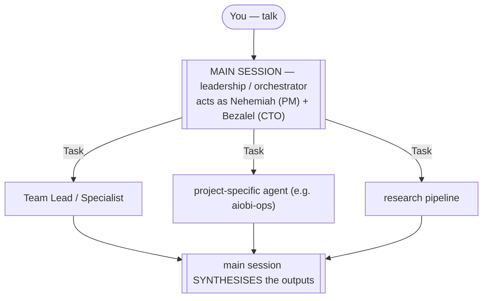
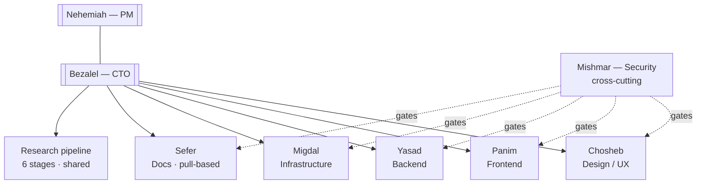
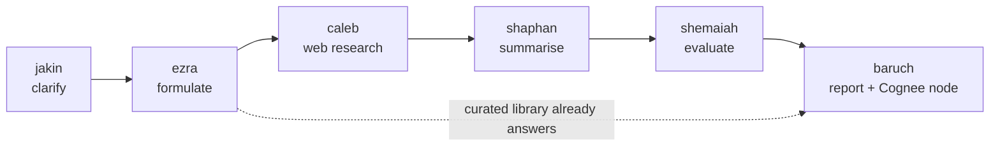

# 03 — Orchestration

> Goal: explain how work actually flows once you've started a session in a
> MISHKAN-initialised project, with the platform constraints that shape it.

## The single most important fact

**Claude Code has no nested delegation.** A subagent cannot spawn another
subagent — confirmed in the official subagent docs. The `Task` tool in a
subagent's frontmatter is **inert** when the subagent runs.



*One level deep, siblings, no nesting* — the main session delegates via `Task`, then
synthesises. A subagent cannot spawn another: its own `Task` tool is inert.

Three things follow:

1. **The main session is leadership.** It loads the MISHKAN identity from
   `~/.claude/CLAUDE.md` and acts as Nehemiah (PM) and Bezalel (CTO)
   simultaneously. **Do not invoke the `nehemiah` subagent to orchestrate** —
   a spawned Nehemiah can't delegate either.

2. **Delegation is description-driven**, not config-table driven. There is no
   "task → agent" YAML. The `Task` tool reads each agent's `description:`
   frontmatter and picks one, guided by the `## Routing` prose in
   `~/.claude/CLAUDE.md` and the main session's own judgement.

3. **Team Lead agents (e.g. `eliashib` for Migdal infrastructure) advise and
   plan**, they don't spawn specialists. The main session calls the Lead for
   strategy and the specialists for execution.

## The cast (one level deep, all callable by the main session)

**Two orchestrators** — these *inform* the main session's identity via
CLAUDE.md; you can also call them explicitly as subagents for second opinions.

| Alias | Role |
|---|---|
| `nehemiah` | PM — scope, delivery, sprint state |
| `bezalel` | CTO — technical standards, architecture, quality bar |

**Six teams.** Within each, `Lead → Specialists → QA → Reporter`. QA and
Reporters are structurally separate from the producing agents — no agent grades
its own work.

| Team | Domain | Notable agents |
|---|---|---|
| **Chosheb** | Design / UX | `aholiab` (lead), `hiram` (UI), `deborah` (cognitive UX) |
| **Panim** | Frontend | `huram` (lead), `oholiab` (design system), `salma` (impl), `asaph` (a11y), `jahaziel` (QA) |
| **Yasad** | Backend | `zerubbabel` (lead), `nathan` (architecture), `zadok` (contracts), `hizkiah` (impl), `shallum` (DB), `uriah` (QA) |
| **Mishmar** | Security (cross-cutting) | `phinehas` (lead), `ira` (code-sec, runs the security hook), `benaiah`, `joab` |
| **Migdal** | Infrastructure | `eliashib` (lead), `meshullam` (design), `palal` (systems), `meremoth` (devops), `hanun` (devsecops), `rehum` (SRE) |
| **Sefer** | Documentation (pull-based) | `jehoshaphat` (lead), `seraiah` / `joah` / `shevna` (org/project/team), `jehonathan` (publication) |



*Two orchestrators (the main session embodies both) route to six teams; Mishmar gates
every team's output; the research pipeline is shared. Within each team: Lead → Specialists
→ QA → Reporter, with QA and Reporter structurally separate from the producing agents.*

**Research pipeline** (6 stages): `jakin` → `ezra` → `caleb` → `shaphan` →
`shemaiah` → `baruch`. Each stage is a single-purpose agent. The pipeline is
also a skill (`research-pipeline`) the main session can invoke whole.



*Six single-purpose stages. Ezra short-circuits straight to Baruch when the curated
library already holds the answer — no web research spent.*

Full glossary including each agent's role: [Glossary](./08-glossary.md).
Naming rationale: [`docs/design/MISHKAN_agent_aliases.md`](../design/MISHKAN_agent_aliases.md).

## Model routing — `model-routing.yaml` is authoritative

Every agent has a Claude model tier (`opus` / `sonnet` / `haiku`). The mapping
lives in [`payload/mishkan/config/model-routing.yaml`](../../payload/mishkan/config/model-routing.yaml)
and is **enforced at delegation time** by a `PreToolUse` hook that intercepts
the `Task` tool call and injects the right `model` via
`hookSpecificOutput.updatedInput`.

```
config/model-routing.yaml   ← edit here (single source of truth)
        ↓
hooks/model-route.py        ← PreToolUse on Task|Agent
        ↓
Task tool input gets `model: <tier>` injected
        ↓
subagent runs on the right tier, regardless of its frontmatter
```

Important nuance baked into the hook (`c6c5645`): it **only injects for agents
explicitly listed in the YAML**. Foreign agents (e.g. `aiobi-ops`, `Explore`)
keep their own frontmatter model — never silently downgraded.

Tier rationale (from the YAML header):

| Tier | Who | Why |
|---|---|---|
| Opus | orchestrators, Team Leads, knowledge publication | judgement-heavy |
| Sonnet | senior specialists, anything that **writes code** | precision on the codebase |
| Haiku | QA (evaluate-only), Reporters (collect-only), pure advisors | cost-sensitive, no risk to code |

To change a tier: **edit the YAML**, not the agent frontmatter. The hook makes
the YAML win.

## Skills — invoked on demand, never preloaded

Each agent has the `Skill` tool in its `tools:` allowlist. When the agent reads
a skill name in its prompt and decides it applies, it invokes the skill on the
fly. **No `skills:` frontmatter preload** is used — that would inject the full
SKILL.md text into the agent's context on every startup for every preloaded
skill, across 45 agents. The cost rationale is captured in
`payload/mishkan/AGENT_SPEC.md` while the organization rename is deferred.

How an agent knows which skills to reach for: each agent's prompt carries a
short **"Skills (invoke on demand)"** section listing its specific skills.
Salma's, for example: `react-modernization`, `nextjs-app-router-patterns`,
`responsive-design`, `modern-javascript-patterns`.

Skills shipped by MISHKAN itself (orchestrating the 150+ user skills):

| Skill | Purpose |
|---|---|
| `mishkan-init` | scaffold a project (see [02](./02-project-init.md)) |
| `ares-ingest` | selectively add docs to the work cognee (see [05](./05-selective-ingest.md)) |
| `research-pipeline` | run Jakin→Ezra→Caleb→Shaphan→Shemaiah→Baruch |
| `sprint-report` | a Reporter assembles `team-report.json` at milestone |
| `cognee-promote` | promote knowledge with blast-radius routing |
| `cognee-quickstart` | bring cognee up if it's not running yet |
| `context-compress` | Cognee-offload helper for long sessions |
| `sefer-pull` | trigger doc updates at milestones or high-blast events |
| `dependency-vetting` | vet a single dep via the research pipeline |
| `dependency-audit` | per-project supply-chain audit |

## Hooks — the binding layer

Hooks make the rules deterministic; rules and prompts alone wouldn't be enough.

| Event | Runtime coverage | Script | What it does |
|---|---|---|---|
| write/edit before hook | Claude, Codex `apply_patch`, OpenCode `write`/`edit`/`apply_patch` | `pre-tool-security.sh` (Ira) | scan added content for secrets, eval, SQL string-concat, unsafe execution; block on match |
| `PreToolUse: Task|Agent` | Claude | `model-route.py` | inject the model tier from `model-routing.yaml` |
| `PreToolUse: Bash` | Claude | existing bun command-validator (preserved) | command validation |
| tool before/after | Claude, Codex, OpenCode | `pre-tool-trace.sh` + `post-tool-observe.sh` | record duration and append observability events |
| `Stop` | Claude | `stop-reporter.sh` | if the stopped agent declares `role: reporter`, fire the `sprint-report` skill |

The security hook is the one you'll notice — it caught the Gemini API key during
the build (commit `e17f2a9` added a documented exception path for runtime
secret injection into gitignored `.env` files).

## MCP tools in subagents — explicit, not inherited

A real gotcha worth flagging: **Claude Code does not give a subagent access to
the main session's MCP servers automatically.** A subagent (anything spawned
via `Task`) can only call MCP tools that appear in its own `tools:` frontmatter
allowlist. If you see *"MCP tool not in subagent context"* during a research
run, this is the cause.

Tool names follow the pattern `mcp__<server>__<tool>`. The four MISHKAN agents
whose job *is* cognee work have the relevant entries pre-wired:

| Agent | Cognee tools in its allowlist |
|---|---|
| `ezra` (research formulator) | `mcp__cognee__search`, `mcp__cognee-curated__search` |
| `shemaiah` (research evaluator) | `mcp__cognee__search`, `mcp__cognee-curated__search` |
| `baruch` (research reporter) | `mcp__cognee__search`, `mcp__cognee__add`, `mcp__cognee__cognify`, `mcp__cognee__memify` |
| `jehonathan` (knowledge publication) | `mcp__cognee__search` |

The other 41 agents do not have cognee MCP access by default — they don't need
it. If you add a new agent whose work depends on cognee, add the specific MCP
tools to its `tools:` line. Don't grant the whole MCP server unless the agent
genuinely needs every operation; the principle is the same as the deny-list
philosophy below.

The fallback pattern when an agent legitimately needs cognee but doesn't have
the tools: **the main session does the MCP call**. The subagent returns a
structured payload; the main session reads it and calls `mcp__cognee__add` /
`mcp__cognee__cognify` itself. Slower than direct access but always available.

## Deny-list and asymmetric delegation

Two layers of "the agent never does this":

- **Project `settings.json`** (seeded by init) — deny: `git push`, `ssh`,
  `sudo`, `docker exec`.
- **Standards** (rules layer, baked in) — *"stateful operations stop at the
  engineer's hands"*: schema-migration execution, log-forensics execution,
  production access.

These are not soft preferences. They are the boundary between generative work
(safe to delegate one-shot) and stateful work (one mistake is not reversible
by re-prompting).

## Routing in practice — a DevOps example

You: *"Get aiobi-mail off the staging stack's stale iptables rules without
touching production."*

Main session (acting as leadership):

1. Reads the codebase orientation in `CLAUDE.md` for context.
2. Searches cognee `work` store for past incidents touching this area.
3. Spawns `eliashib` (Migdal lead) to plan the work — returns a routing
   recommendation.
4. Spawns `palal` (systems specialist) to inspect the iptables state — returns
   findings.
5. Spawns `aiobi-ops` (your project-specific ops agent) for the staging-stack
   reality (servers, gotchas, incident history).
6. Synthesises 3, 4, 5 into a concrete plan with exact commands.
7. Hands you the commands. You run them.

Migdal agents and `aiobi-ops` did **not** talk to each other — they are
siblings, one level deep. The synthesis was the main session's job.

## See also

- Plan / decision file behind the model-routing hook: commit `c6c5645`,
  `payload/mishkan/hooks/model-route.py`.
- Skill wiring decisions: `payload/mishkan/AGENT_SPEC.md`.
- Research pipeline shape:
  [`docs/design/MISHKAN_harness_design.md`](../design/MISHKAN_harness_design.md)
  §5.
- Token economy / context architecture:
  [`docs/design/MISHKAN_token_optimisation.md`](../design/MISHKAN_token_optimisation.md).
