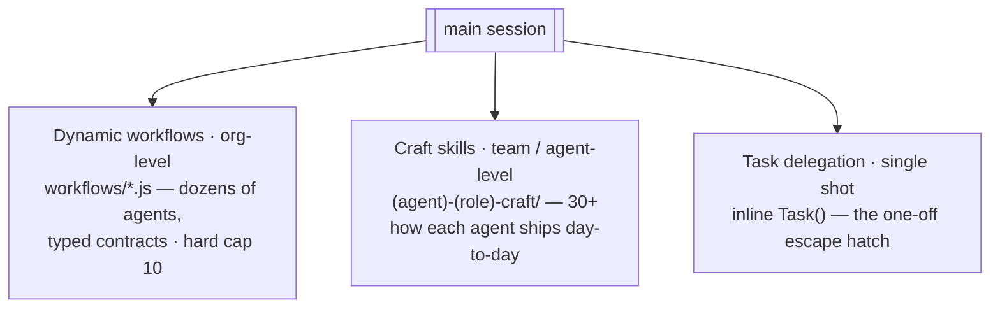

# 09 — Dynamic Workflows

> Goal: explain when MISHKAN reaches for a dynamic workflow vs ordinary
> Task delegation, the **20 workflows shipped** (10 org-level + 10 team-
> level), the cost gate, and how dynamic workflows relate to the 30+
> craft skills that drive each team's day-to-day work.

## Three layers, not one

MISHKAN has **three** levels of orchestration. Conflating them produces
wrong tools at the wrong level:

| Layer | Lives in | Owns | Examples |
|---|---|---|---|
| **Dynamic workflows** (org-level) | `payload/mishkan/workflows/*.js` | The whole harness | `mishkan-sprint-close`, `mishkan-release-readiness`, `mishkan-codebase-audit` |
| **Craft skills** (team / agent-level) | `payload/mishkan/skills/<agent>-<role>-craft/` | One agent or one Team Lead | `hizkiah-backend-impl-craft`, `salma-frontend-impl-craft`, `team-lead-craft` |
| **Task delegations** (single shot) | inline `Task()` call from main session | The caller | "Bezalel, review this ADR" |

**Dynamic workflows** orchestrate dozens of agents in parallel with
typed contracts, adversarial verification, and judge panels. They are
expensive and bounded — hard cap at 10 in the harness. The gate to
add one is high (recurrence + parallelism + repeatable shape).

**Craft skills** are how each agent ships day-to-day work. They are
markdown documents loaded into the agent's context. There are 30+ of
them today — every specialist (Hizkiah, Salma, Nathan, etc.) has at
least one craft skill that codifies "this is how I do my job". Team
Leads additionally load `team-lead-craft` which captures the
orchestration shape they apply to their team's daily flow (handoff,
review, escalation, sprint contribution).

**Task delegations** are the one-off escape hatch — when neither a
workflow nor a craft skill captures the shape, the main session
spawns one or more subagents inline.

*Three orchestration layers — reach for a dynamic workflow only when recurrence +
parallelism + a repeatable shape all hold; otherwise a craft skill or a one-off Task.*

If you find yourself asking "is THIS a workflow?", apply the gate
below. If it doesn't pass all three, it's probably a craft skill
addition or a one-shot Task.

## What a workflow is, in one paragraph

A dynamic workflow is a JavaScript script the **main session** executes
via the `Workflow` tool. It spawns subagents in parallel (cap:
`min(16, cpu-2)` per run; 1,000 agents per run absolute max), validates
their structured outputs at the tool layer, and returns a single
synthesised result. Workflows are **main-session-only** — a subagent
cannot call `Workflow`. They earn their cost when the alternative
would be sequential Task delegation that wastes wall-clock or hides
errors that adversarial verification would catch.

Reference: [Anthropic docs — orchestrate subagents at scale](https://code.claude.com/docs/en/workflows).

## When to reach for one

The gate MISHKAN applies — **yes only if all three**:

1. The task runs ≥ 10× per quarter (justifies codification).
2. The parallel agent count is ≥ 6 (justifies workflow runtime cost
   over Task delegation).
3. The orchestration is repeatable in shape (same script, different
   inputs).

Anything that fails any of the three is better as Task fan-out from
the main session.

## Team-level workflows — the 8 shipped (ADR D-010)

Each team also has a small set of **team-level workflows** for the
recurring high-stakes orchestrations that *only that team* runs. Hard
cap: 4 per team. Co-owned by PM + CTO per ADR D-010. Day-to-day shipping
flows (feature ship, refactor, review) stay at the craft-skill layer —
the team-level workflows are reserved for the orchestrations where
parallelism + adversarial verification actually change the outcome.

| Team | Workflow | What it does |
|---|---|---|
| Chosheb | [`chosheb-feature-ship`](../../payload/mishkan/workflows/chosheb-feature-ship.js) | Design → handoff package (DS fit + a11y + assets + QA) |
| Panim | [`panim-ds-rollout`](../../payload/mishkan/workflows/panim-ds-rollout.js) | Token change propagated to all consumers (worktree + a11y + visual regression) |
| Yasad | [`yasad-data-migration-wave`](../../payload/mishkan/workflows/yasad-data-migration-wave.js) | Wave of DB migrations, per-table 4-lens review |
| Yasad | [`yasad-schema-evolution`](../../payload/mishkan/workflows/yasad-schema-evolution.js) | Zero-downtime phased schema change with rollback |
| Mishmar | [`mishmar-security-gate`](../../payload/mishkan/workflows/mishmar-security-gate.js) | Pre-merge security gate, 3 lenses + adversarial refute |
| Migdal | [`migdal-infra-change`](../../payload/mishkan/workflows/migdal-infra-change.js) | Infra change validated by 5 lenses |
| Migdal | [`migdal-dr-drill`](../../payload/mishkan/workflows/migdal-dr-drill.js) | DR drill — enumerate, simulate, verify, RTO/RPO measurement |
| Sefer | [`sefer-release-notes`](../../payload/mishkan/workflows/sefer-release-notes.js) | Release notes from git log per category, style-guided |

Day-to-day shipping flows that are *not* workflows (and why):

- **Feature ship cycle** (SRS → CONTRACT → impl → tests → review) — sequential
  with a small parallel window during review only; Task delegation handles
  it cheaper than a workflow.
- **PR review** — handled by craft skills (`huram-frontend-lead-craft`,
  `zerubbabel-backend-lead-craft`) + Task fan-out when needed.
- **Component build per design** — shape varies per component too much for
  a stable script (fail rule 3 of the gate).

Adding a team-level workflow requires PM + CTO joint review per ADR D-010
(`docs/design/MISHKAN_decisions.md#D-010`). Each team has spare slots
(cap 4) — candidates compete by recurrence + parallelism + repeatability.

## The 10 org-level workflows

| Workflow | Pattern | Invoked by | Args |
|---|---|---|---|
| [`mishkan-sprint-close`](../../payload/mishkan/workflows/mishkan-sprint-close.js) | barrier + aggregator | Nehemiah at `/sprint-close` | `{ sprint }` |
| [`mishkan-deep-research`](../../payload/mishkan/workflows/mishkan-deep-research.js) | pipeline + 3-vote refute | Baruch path; any high-stakes research | `{ intent, agent, team, sprint, applied_to_task? }` |
| [`mishkan-codebase-audit`](../../payload/mishkan/workflows/mishkan-codebase-audit.js) | multi-modal sweep + adversarial verify | Phinehas (security), Huram (a11y/perf), Bezalel (pre-release) | `{ project_root, lenses[], target_glob?, max_files? }` |
| [`mishkan-migration-wave`](../../payload/mishkan/workflows/mishkan-migration-wave.js) | pipeline + worktree + judge panel on review | Lead routes large refactor | `{ project_root, target_glob, transformation, transformer_agent, reviewers, verify_command? }` |
| [`mishkan-architecture-panel`](../../payload/mishkan/workflows/mishkan-architecture-panel.js) | judge panel + impact-fanout + synthesis | Bezalel gates wide-answer architecture decisions | `{ decision, context, horizon? }` |
| [`mishkan-release-readiness`](../../payload/mishkan/workflows/mishkan-release-readiness.js) | barrier + nested workflow | Nehemiah + Bezalel before every prod deploy | `{ project_root, release_tag, verify_commands, audit_security? }` |
| [`mishkan-init`](../../payload/mishkan/workflows/mishkan-init.js) | pipeline with overlap | `/mishkan-init` | `{ project_name, project_root, raw_intent, stack_hint? }` |
| [`mishkan-blast-radius`](../../payload/mishkan/workflows/mishkan-blast-radius.js) | Graphify + 3-lens orthogonal | gated by `/plan` | `{ target, depth?, project, min_sites_to_verify? }` |
| [`mishkan-knowledge-gap-discovery`](../../payload/mishkan/workflows/mishkan-knowledge-gap-discovery.js) | parallel probe + loop-until-dry | sprint close (optional) | `{ concepts[], project }` |
| [`mishkan-standards-rollout`](../../payload/mishkan/workflows/mishkan-standards-rollout.js) | per-team translate + verify + ratify | new rule lands in `y4nn-standards.md` | `{ rule_text, rule_id?, scope_hint? }` |

## How invocation actually happens

Subagents cannot invoke `Workflow`. The chain:

1. A craft skill (Nehemiah-PM, Bezalel-CTO, Team-Lead, Baruch-research,
   Hizkiah-impl) carries an explicit section saying *"the main session
   invokes Workflow(...) when X"*.
2. When the main session reads that skill in the context of X, it
   issues the `Workflow(...)` call directly.
3. The workflow runs in the background; `/workflows` watches progress.
4. The result lands as a single synthesised object — no turn-by-turn
   transcript in the main session's context.

If a subagent finds itself needing a workflow (e.g. Phinehas wants a
codebase audit), the subagent's response surfaces the recommendation
to the main session, which then decides whether to fire.

## Patterns the 10 scripts use

From the [community patterns catalogue](https://github.com/ray-amjad/claude-code-workflow-creator/blob/main/references/patterns.md)
and Anthropic's docs:

| Pattern | Used by |
|---|---|
| Fan-out → synthesize | `codebase-audit`, `release-readiness`, `architecture-panel` |
| Pipeline with overlap | `deep-research`, `migration-wave`, `init` |
| Barrier `parallel()` | `sprint-close`, `release-readiness`, `architecture-panel` (Vote) |
| Adversarial verification (3-vote refute) | `deep-research`, `codebase-audit` |
| Judge panel | `architecture-panel`, `migration-wave` (2-reviewer accept) |
| Nested workflow (1 level) | `release-readiness` → `codebase-audit` |

## Cost — read the numbers, not the hype

Workflows are real money. Some references:

- The bundled `/deep-research` run on a personal-profile sweep this
  session: **98 agents**, **~2.8M subagent tokens**, ~8 min wall.
- The marquee public case (Bun Zig→Rust port): **hundreds of agents
  per workflow**, multiple workflows chained, 750k LoC, 11 days.

Per-workflow expected cost (rough orders of magnitude):

| Workflow | Cost class | Why |
|---|---|---|
| `sprint-close` | low | 6 reporters; bounded |
| `release-readiness` | low–medium | 7–8 parallel checks |
| `deep-research` | medium | 6 stages × per-sub-question fan-out × 3-vote |
| `architecture-panel` | medium | 3 proposals × 3 reviewers + synthesis |
| `init` | medium | 6 artefacts pipelined |
| `codebase-audit` | high | `files × lenses × 3-vote-verify` |
| `migration-wave` | very high | `files × (1 transformer + N reviewers + verify)` |

**Run on a small slice first.** For migration and audit, one directory
before the whole repo, one lens before all lenses.

## What's deliberately *not* a workflow

These were considered and rejected as workflows; they stay as Task
delegation or skills:

- Per-team PR review (`mishmar-pr-multi-lens`, `panim-test-matrix`):
  fail rule 1 (frequency) or rule 2 (agent count).
- Per-team handoffs (`chosheb-handoff-package`): fail rule 2.
- Component build per design handoff: fail rule 3 (shape varies per
  component too much for a stable script).
- N-per-team-sprint-close: composed via the orchestrator-tier
  workflow `mishkan-sprint-close`; no separate per-team workflow.

The line is: when a Task fan-out of ≤ 5 agents handles the work and
no adversarial verification is needed, no workflow.

## See also

- [`payload/mishkan/workflows/README.md`](../../payload/mishkan/workflows/README.md)
  — script catalogue with per-file links.
- [Anthropic docs — workflows](https://code.claude.com/docs/en/workflows).
- [The 9 patterns reference](https://github.com/ray-amjad/claude-code-workflow-creator/blob/main/references/patterns.md).
- [OneRedOak's 3-workflow production setup](https://github.com/OneRedOak/claude-code-workflows)
  — the inventory data point that anchored the 7-workflow ceiling.
