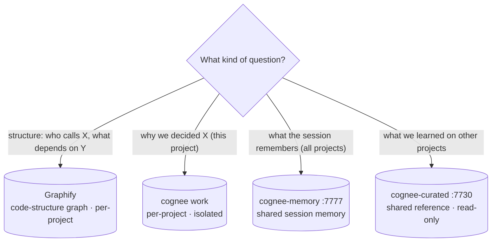

# 11 — Graphify (code-structure graph)

> Goal: use Graphify as the **code-structure** surface of the MISHKAN
> four-surface knowledge model — 1 code-structure (Graphify) + 3 cognee
> stores (work · memory · curated) — so that "who calls X" / "what
> depends on Y" questions cost ~1.8k tokens instead of lifting the whole
> repo into context.

## What it is

[Graphify](https://github.com/safishamsi/graphify) is a tree-sitter
based code-graph extractor with a query path that traverses the graph
to answer structural questions. MIT, Python, `uv tool install`-able.

MISHKAN has **four knowledge surfaces** — one code-structure surface
(Graphify) and three cognee stores — each owning one epistemic question
with no overlap of write authority:

| Surface | Question it answers | Source | D-ref |
|---|---|---|---|
| **Graphify** (per-project, `graphify-out/`) | *How is the code structured?* | tree-sitter AST + optional LLM enrichment, deterministic, re-derivable | D-008 |
| **Cognee work** (per-project Ladybug, own port) | *Why does this code exist and what did we decide?* | agent-ingested ADRs, runbooks, resolved research | D-008, D-012 |
| **cognee-memory** (`:7777`, shared) | *What does the session remember across all projects?* | `claude_code_memory` dataset; shared, not re-derivable from docs | D-012 |
| **cognee-curated** (`:7730`, shared) | *What did we learn on other projects?* | promoted cross-project reference library, read-only from projects | D-007 |

The **D-008 framing** ("three stores: Graphify · Cognee work · Cognee
curated") reflects the stack as it stood before D-012. D-012 added the
`cognee-memory` pillar (repurposing the old shared `:7777` Neo4j box
for session memory only), bringing the total to four. The two framings
are not contradictory — they count different cuts: D-008 defines the
write-discipline split; D-012 adds a fourth surface within the cognee
tier. The crisp routing test remains:
**structure → Graphify, project semantics → Cognee work.**



*Four surfaces, one epistemic question each — no overlap of write authority.*

## Install

```bash
uv tool install "graphifyy>=0.8.33"
graphify --version
```

The PyPI package is `graphifyy` (double-y), the binary is `graphify`.
The `>=0.8.33` pin matters — earlier 0.8.x had a test-file-orphan bug
(test imports didn't resolve to file-level edges, so test files looked
disconnected from the source they covered). Fixed in 0.8.33.

Useful soft-breaking change in 0.8.29 to be aware of: project-local
providers under `./.graphify/providers.json` no longer auto-load by
default. Set `GRAPHIFY_ALLOW_LOCAL_PROVIDERS=1` if you use per-project
LLM providers (the deterministic AST path doesn't need this).

## Bring up the graph for a project

From the project root:

```bash
graphify update .
```

First run on the MISHKAN harness: **205 files → 2,370 nodes → 27.8 s**.
Subsequent `graphify update .` runs are incremental and sub-second on
warm cache.

**Keep the graph fresh — install the git hooks.** The canonical
maintenance path (recommended by the upstream community, not cron):

```bash
graphify hook install   # registers post-commit / post-checkout / post-merge / post-rewrite
                        #   + a `graphify-json` git merge driver so the graph
                        #     union-merges on parallel branches (no conflicts)
graphify hook status
graphify hook uninstall # later, if you want to remove them
```

Without the hooks the graph drifts vs HEAD silently — symptoms (from
upstream issues): `graphify query` returns stale `file:line` citations,
`GRAPHIFY_OUT/GRAPH_REPORT.md` stays at the old node count after a
refactor. The hooks rebuild incrementally in milliseconds; the merge
driver makes `graph.json` conflict-free across branches.

Output lives in `<project>/graphify-out/`:

```
graphify-out/
├── graph.json          # the AST graph (consumed by `graphify query`)
├── graph.html          # interactive visualisation, open in a browser
├── GRAPH_REPORT.md     # god-nodes + anomalies + community summary
└── manifest.json       # quick stats (nodes / edges / communities)
```

> `graphify-out/` is gitignored in this repo (project-local artefact,
> re-derivable). On your own projects, decide per-project whether to
> commit it; the harness convention is to NOT commit it.

## Querying

```bash
graphify query "who calls process_payment"
graphify query "what depends on the User model" --budget 1500
graphify affected "process_payment" --depth 3
graphify path "ClassA" "ClassB"
graphify explain "MishkanWatch"
```

Default budget is 2000 tokens; the answer is plain text with `file:line`
citations.

POC numbers on the MISHKAN harness (2026-06-07):

| Question | Tokens | Ratio vs naive baseline |
|---|---:|---:|
| how does authentication work | ~2,116 | 74.7× |
| what is the main entry point | ~1,842 | 85.8× |
| how are errors handled | ~1,115 | 141.8× |
| what connects the data layer to the api | ~2,278 | 69.4× |
| what are the core abstractions | ~1,619 | 97.6× |
| **average** | **~1,793** | **88.1×** |

Naive baseline = lifting all 118,500 words / ~158,000 tokens of source
into the model context (Graphify's own README methodology). Full
method: `docs/research/graphify-token-saving-poc.md`.

> **Important footnote on the 88.1×.** This is a *mixed-corpus,
> naive-baseline* ratio — the same methodology as Graphify's upstream
> 71.5× claim. Third-party measurements on *real Claude / Cursor
> sessions* (where the assistant already scopes) report much smaller
> reductions: roughly **7-8×** on small targeted sessions, **7-30×**
> on real codebases. Treat 71.5× / 88.1× as **directional**, not
> spec-grade: they prove "Graphify costs orders of magnitude less than
> reading everything" — they don't prove "your next chat session costs
> 88× fewer tokens." The advisory hook (D-009) keeps emitting telemetry
> alongside the advisory injection — the firing-vs-graphify-query ratio
> on real sessions is the data path to tighten this claim.

## How MISHKAN agents use it

Twenty code-touching dev agents across all six teams (per D-009
amended scope, 2026-06-07) load **graphify-query-craft**: Yasad backend
(Hizkiah, Nathan, Zadok, Shallum, Uriah) · Panim frontend (Salma,
Oholiab, Asaph, Jahaziel) · Chosheb UI (Hiram) · Mishmar code-security
(Ira, Joab, Hushai) · Migdal infra-code (Palal, Meshullam, Meremoth,
Hanun) · Sefer code-documentation (Joah, Shevna, Jehonathan). Its core
rule:

> Structure question → `graphify query`.
> Semantic question → Cognee work.

The PreToolUse hook **`pre-tool-knowledge-route.sh`** (D-009 amendment
2026-06-07 — Phase 2 shipped) routes the agent to the right knowledge
surface. On every structural Read / bare-identifier Grep, it does two
things:

- **Emits telemetry**: a `hook_fire` event on the bus. The Knowledge
  tab's activity counter records it.
- **Injects a 4-surface palette** via
  `hookSpecificOutput.additionalContext` listing every knowledge surface
  MISHKAN exposes, with pre-formed commands and per-surface signals so
  the agent picks the right one — not graphify by default.

The four surfaces (D-008 + this amendment):

| Surface | Question it answers |
|---|---|
| **CODE STRUCTURE** (Graphify) | "who calls X", "what depends on Y", "path between A and B", impact / blast-radius |
| **THIS project's MEMORY** (Cognee work) | "why did WE decide X", "what's OUR convention", "what was resolved last sprint" — ADRs, runbooks, past research |
| **CROSS-PROJECT REFERENCE** (Cognee curated) | "what does the spec say about X", "what did we learn on OTHER projects" — shared read-only library |
| **Literal file content / text match** (Read or Grep) | "what's in THIS specific file", "every line containing this exact string" |

The advisory carries **real signals** inlined per call, so the agent
doesn't pick blind:

- Graph node + edge count, last-scan age (with `(stale — /code-graph scan to refresh)` flag when > 1h)
- For Grep on a bare identifier: a `jq` check on `graph.json` says whether the target is actually a node in the graph. If not, the advisory explicitly warns "don't burn ~1.8k tokens on a seedless query"
- For Read: the file's line count and an approximate token cost (`~lines × 4`)
- Cognee work and curated node counts (from the daemon's poll cache at `~/.cache/mishkan/cognee-counts.json`) so "(0 nodes — nothing ingested yet)" replaces a misleading recommendation

The hook never sets `permissionDecision` — purely advisory, the
Read/Grep still proceeds. When the project has no `graphify-out/`
directory the CODE STRUCTURE line flips to an install hint; the cognee
lines stay since the MCP surface is independent of graphify state.

No pre-cooked verdict ("soft" vs "strong") and no invented thresholds.
Threshold tuning is the D-011 telemetry workflow's job (`hook_fire` vs
`graphify_query` / `cognee_op` rates, reviewed at `/sprint-close`).

Performance contract for the hook: ≤50 ms p95, fail-open everywhere.

## Knowledge-tab observability

The TUI's **Knowledge** tab surfaces Graphify activity alongside Cognee
in the "Recent ops" panel:

- `graphify_scan` events fire when `graphify-out/graph.json` mtime
  changes (i.e. after `graphify update .` completes). The event payload
  carries `nodes`, `edges`, `communities` from the manifest.
- `graphify_query` events fire when `graphify save-result` lands a new
  file under `graphify-out/memory/`. The payload carries the question
  + a 200-char excerpt of the answer.

Both events come from the daemon source `graphify_tail` (Python
asyncio, polls every 5 s, fail-open).

## When NOT to use Graphify

Per D-008's "what NOT to do" list:

- Don't use Graphify to answer SEMANTIC questions ("why is this
  deprecated?"). Those go to Cognee work.
- Don't use it on a project that doesn't have a `graphify-out/` dir —
  the cost of an initial scan (~28 s on a 200-file repo) is not paid
  for a single one-off structural question. Fall back to grep / Read.
- Don't cite a graph answer without the `file:line` citations from the
  query output — "according to the graph" without an id is fabrication.

## Known limitations (community-sourced)

- **Dynamic dispatch / reflection** — `getattr`, `eval`,
  dict-of-callables, runtime monkey-patching are invisible to AST.
  Recent 0.8.x added cross-language type-reference edges that recover
  *some* missing links via type context, but the gap stays.
- **Runtime configuration** (env vars, feature flags, DI containers,
  Spring-like wiring) — not in the AST. Community recipe: feed the YAML/
  JSON config files as docs into the same graph; Graphify's multi-modal
  ingest will surface them as nodes.
- **`GRAPHIFY_OUT` env var ignored by `query` / `path` / `explain`** —
  upstream issue still open at research time. If you relocate
  `graphify-out/`, pass `--graph <path>` explicitly instead.
- **`./.graphify/providers.json` no longer auto-loads** (0.8.29
  soft-break). Set `GRAPHIFY_ALLOW_LOCAL_PROVIDERS=1` if you use
  per-project provider configs.

## Refreshing the graph

Graphify indexing is **manual** — there is no auto-update on file
changes today. Three equivalent ways to refresh:

```bash
graphify update .                            # direct CLI
npx mishkan-harness code-graph scan          # MISHKAN wrapper
/code-graph scan                             # slash command (same wrapper)
```

A read-only inspection of the current graph (no rebuild):

```bash
npx mishkan-harness code-graph status        # nodes / edges / last scan timestamp
/code-graph status                           # same
npx mishkan-harness code-graph open          # opens graph.html in the browser
```

When the advisory hook fires and you suspect the graph is stale, the
hook's own advisory text reminds you to run `npx mishkan-harness
code-graph scan` first.

## Project init

`/mishkan-init` (per the updated skill) optionally runs the initial
`graphify update .` after the spec chain lands, so the project has a
graph from sprint S0 onwards. Skipped automatically on projects that
opted out of the structural layer.

## See also

- [D-008](../design/MISHKAN_decisions.md#d-008) — three-layer knowledge
  epistemology (Graphify + Cognee work + Cognee curated; pre-D-012 framing).
- [D-009](../design/MISHKAN_decisions.md#d-009) — graph-first PreToolUse
  advisory hook (Phase 1 telemetry-only, Phase 2 advisory injection —
  both shipped v0.2.3).
- [POC report](../research/graphify-token-saving-poc.md) — verified
  88.1× reduction on the MISHKAN harness, 2026-06-07.
- [Memory layer](./04-memory-layer.md) — the three cognee stores (work,
  memory, curated) that complete the four-surface knowledge model.
- Upstream — https://github.com/safishamsi/graphify.
