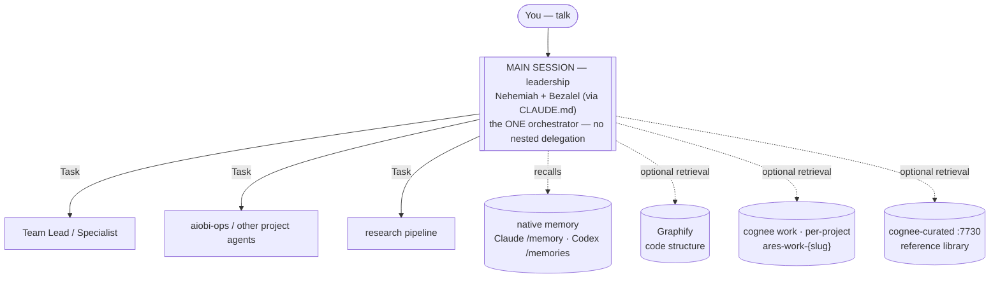

# ARES / MISHKAN — Usage Documentation

> ARES is the portable runtime namespace for the current MISHKAN organisation.
> This corpus is the **how**. The **why** lives in
> [`docs/design/`](../design/).

A Claude Code, Codex, or OpenCode session, turned into a 45-agent
software-engineering organisation with deterministic constraints, an
asymmetric AI-vs-human delegation boundary, native runtime memory by default,
and optional retrieval surfaces for larger projects: one code-structure surface
(Graphify) plus three cognee stores (per-project work · session memory ·
curated reference).

## In five minutes

*The main session is the one orchestrator — it delegates one level deep (siblings) and
uses runtime memory by default. Cognee and Graphify are opt-in retrieval surfaces
for larger projects. (Diagrams render on GitHub.)*

- **Main session is leadership.** It loads MISHKAN identity from
  `~/.claude/CLAUDE.md` and routes work one level deep.
- **45 agents** across **6 teams** + **2 orchestrators** + a **6-stage research
  pipeline**.
- **Native memory first.** Claude Code `/memory` and Codex `/memories` carry
  preferences, conventions, and cross-session recall without Docker/API setup.
- **Optional retrieval surfaces** — 1 code-structure + 3 cognee stores:
  - **Graphify** (per-project, `graphify-out/`) — code structure: call graphs,
    dependents, blast-radius. AST-derived, deterministic, re-derivable. D-008.
    Not installed by `ares install`; run `uv tool install "graphifyy>=0.8.33"`.
  - **Cognee work** (per-project Ladybug, own port) — project semantic memory:
    decisions, runbooks, ADRs. D-012.
  - **cognee-memory** (`:7777`, shared) — session memory shared across all
    projects; `claude_code_memory` dataset only.
  - **cognee-curated** (`:7730`, shared) — cross-project reference library;
    read-mostly, promoted at `/sprint-close`. D-007.

  The D-008 framing ("three stores") predates D-012 and counts Graphify + the two
  cognee stores as they existed then. D-012 added the `cognee-memory` pillar,
  making the total four. The `cognify → memify` (extraction → enrichment) and
  `search` operations are exposed via MCP for the three cognee stores. See
  D-007 + D-008 + D-012.
- **Selective ingest**: docs enter the Cognee work graph only when tagged
  (`ares: ingest`) or explicitly invoked. No bulk-ingest, no PII bleed.

## Chapter index

| # | Chapter | What it covers |
|---|---|---|
| 01 | [Installation](./01-installation.md) | Prerequisites, `npx ares-harness install --target ...`, layout, uninstall |
| 02 | [Project initialisation](./02-project-init.md) | `ares project init`, `/ares-init`, scope choices, brownfield handling |
| 03 | [Orchestration](./03-orchestration.md) | Main-session-as-orchestrator, model routing, skills on-demand |
| 04 | [Memory layer](./04-memory-layer.md) | Native runtime memory by default; optional Cognee work + `cognee-memory` (`:7777`) + `cognee-curated` (`:7730`) |
| 05 | [Selective ingest](./05-selective-ingest.md) | `ares knowledge ingest`, frontmatter tagging, memory-is-opt-in |
| 06 | [LLM provider profiles](./06-llm-providers.md) | Gemini/NVIDIA/Ollama/OpenAI/Anthropic, rate vs daily caps |
| 07 | [Troubleshooting](./07-troubleshooting.md) | Real gotchas + fixes from the build |
| 08 | [Glossary](./08-glossary.md) | 45-agent roster (alias → role → team), key terms |
| 09 | [Dynamic Workflows](./09-workflows.md) | 10 org-level + 10 team-level workflows, ADR D-010 portfolio discipline |
| 10 | [Observability](./10-observability.md) | Cross-session daemon + Textual TUI; 8 tabs (Live · Agents · Workflows · Knowledge · Activity · Org-Ref · Usage · Skills), project filter (`p`) |
| 11 | [Graphify](./11-graphify.md) | Code-structure graph; queries at ~1.8k tokens (88.1× reduction, POC-verified); D-008 + D-009 |
| 12 | [The `ares` CLI](./12-cli.md) | One control surface — semantic `<object> <verb>`: `knowledge-stack` / `project-work-store` / `knowledge` (configure · ingest · curate · reset) / `model` (re-tier agents) / `observability` / `org`; D-015 · D-016 · D-017 |
| 12 | [Skill discovery](./12-skill-discovery.md) | Universal indexer + 3-bucket router across MISHKAN, user, plugin, and project skills; D-011 |

## Where to start

- **First install:** [Installation](./01-installation.md) → [Project init](./02-project-init.md).
- **Already installed, want to understand routing:** [Orchestration](./03-orchestration.md).
- **Want to add knowledge to memory:** [Selective ingest](./05-selective-ingest.md).
- **Hit an error:** [Troubleshooting](./07-troubleshooting.md).
- **Confused by an agent name:** [Glossary](./08-glossary.md).

## Authoritative references this documentation builds on

- [`docs/design/MISHKAN_harness_design.md`](../design/MISHKAN_harness_design.md) — the 5-layer architecture and rationale.
- [`docs/design/MISHKAN_decisions.md`](../design/MISHKAN_decisions.md) — D-001…D-012 with rationale.
- [`docs/design/MISHKAN_agent_aliases.md`](../design/MISHKAN_agent_aliases.md) — the biblical roster.
- [`docs/design/MISHKAN_ontology.md`](../design/MISHKAN_ontology.md) — cognee entity + relationship types.
- [`docs/design/MISHKAN_token_optimisation.md`](../design/MISHKAN_token_optimisation.md) — context economy.
- The harness git history — every operational claim in these docs traces back
  to a specific commit so docs and code stay anchored.

## Conventions used in this corpus

- **Code blocks** are copy-paste-ready (no hidden context unless noted).
- **Tables** carry choices and trade-offs; prose carries decisions.
- **`cmd`** = something you run. **`file`** = something you read or edit.
- *Italics* on a path on first mention; later mentions are plain `path`.
- "**You**" = the engineer at the keyboard. "**The agent**" = the main Claude
  session (which is *leadership* — that distinction matters; see
  [Orchestration](./03-orchestration.md)).
